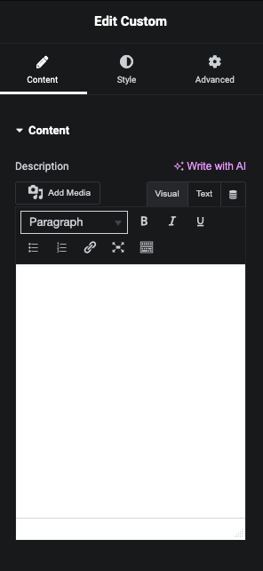

## Elementor Wysiwyg Control

> [Back Home](../README.md)

To create a new control the Elementor plugin, you need to follow these steps:



```php
// Include Elementor's Controls_Manager class
use Elementor\Controls_Manager;
```

### Wysiwyg Control

```php
// Text Control
$this->add_control(
    'description',
    [
        'type'        => Controls_Manager::WYSIWYG,
        'label'       => __( 'Description', 'elementor-helper' ),
        'label_block' => true,
        'rows'        => 5,
        'dynamic'     => [
            'active' => true,
        ]
    ]
);
```

### Render Output

```php
protected function render() {
    $settings = $this->get_settings_for_display();
    ?>
    
    <?php if(!empty($settings['description'])): ?>
        <div class="eh-description">
            <?php echo $settings['description'] ?>
        </div>
    <?php endif; ?>
    
    <?php
}
```

### Example Controls

```php
use Elementor\Controls_Manager;

// Other methods and control definitions...
protected function _register_controls() {
    $this->start_controls_section(
        'section_content',
        [
            'label' => esc_html__( 'Content', 'elementor-helper' ),
            'tab'   => Controls_Manager::TAB_CONTENT,
        ]
    );

    $this->add_control(
        'description',
        [
            'type'        => Controls_Manager::WYSIWYG,
            'label'       => __( 'Description', 'elementor-helper' ),
            'label_block' => true,
            'rows'        => 5,
            'dynamic'     => [
                'active' => true,
            ]
        ]
    );

    $this->end_controls_section();
}
// Other methods and class implementation...

```

> [Back Home](../README.md)
