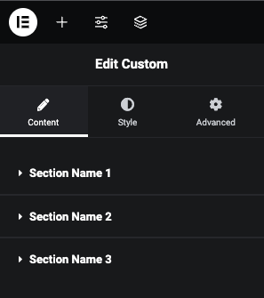

## Elementor Section Creation

> [Back Home](../README.md)

To create a new section with controls using the Elementor plugin, you need to follow these steps:



```php
// Include Elementor's Controls_Manager class
use Elementor\Controls_Manager;
```

### Make Section

```php
// section start
$this->start_controls_section(
    'section_id',
    [
        'label' => esc_html__( 'Section Name', 'elementor-helper' ),
        'tab'   => Controls_Manager::TAB_CONTENT,
    ]
);

$this->end_controls_section();
// section end
```

### Example Usage

```php
use Elementor\Controls_Manager;


// Other methods and control definitions...
protected function _register_controls() {
    $this->start_controls_section(
        'section_id_1',
        [
            'label' => esc_html__( 'Section Name 1', 'elementor-helper' ),
            'tab'   => Controls_Manager::TAB_CONTENT,
        ]
    );

    // Add controls here

    $this->end_controls_section();
    
    $this->start_controls_section(
        'section_id_2',
        [
            'label' => esc_html__( 'Section Name 2', 'elementor-helper' ),
            'tab'   => Controls_Manager::TAB_CONTENT,
        ]
    );

    // Add controls here

    $this->end_controls_section();

    $this->start_controls_section(
        'section_id_3',
        [
            'label' => esc_html__( 'Section Name 3', 'elementor-helper' ),
            'tab'   => Controls_Manager::TAB_CONTENT,
        ]
    );

    // Add controls here

    $this->end_controls_section();
}
// Other methods and class implementation...

```

> [Back Home](../README.md)
